

<h1>哔哩听视频</h1>

<strong>把喜欢的视频，听起来。</strong>

金色王冠（Golden Crown） · QQ 交流群：<strong>1126192808</strong>

  
  
  

  <a href="https://github.com/JinCrown/bililisten/releases">下载 APK</a> ·
  <a href="https://github.com/JinCrown/bililisten/issues">反馈问题</a> ·
  <a href="CONTRIBUTING.md">参与开发</a>

---

## 喜欢在 B 站听歌的小伙伴们，你们好！

想听的那首歌，换了几个平台还是没找到？ 
喜欢的翻唱、现场、改编版本，最后又是在 B 站找到的？

所以，我正在做一款免费、无广告的播放器：**「哔哩听视频」**。

不只是把视频拿来听，更要让你**直接用上原来的 B 站收藏夹**。

**在 B 站看视频，喜欢就收藏，回来接着听。** 
**在哔哩听视频听到喜欢的，随手收藏，B 站也能找到。** 
**一个账号，同一份收藏。两边互通，自动更新。** 
**不需要导入，不需要搬歌单，更不用重新收藏一遍。**

搜索！收藏！想听的，一键播放！ 
锁屏、切后台，喜欢的声音继续听。 
想看画面？一键回到 B 站。

**哔哩听视频，把喜欢的视频，听起来。**

## 看看界面

首页找内容，播放器管收听，字幕页跟上正在听的那一句。

<table>
  <tr>
    <th align="center">首页推荐</th>
    <th align="center">专注收听</th>
    <th align="center">同步字幕</th>
  </tr>
  <tr>
    <td align="center">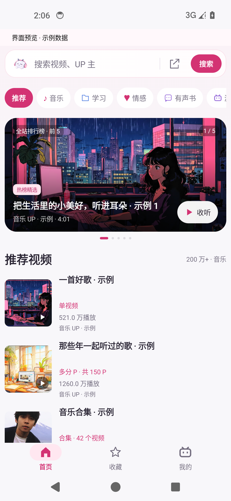</td>
    <td align="center">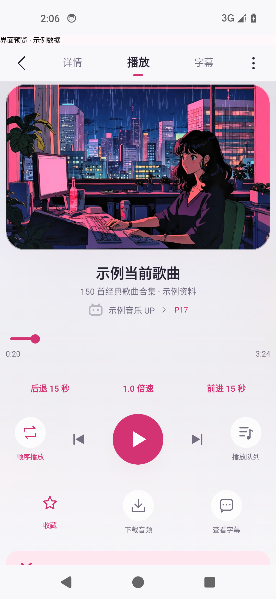</td>
    <td align="center">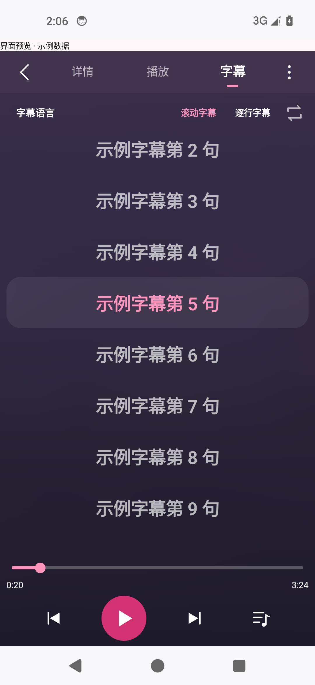</td>
  </tr>
</table>

把喜欢的内容收好，也能继续发现下一段想听的声音。

<table>
  <tr>
    <th align="center">发现音乐 UP</th>
    <th align="center">我的收藏</th>
    <th align="center">我的收听</th>
  </tr>
  <tr>
    <td align="center">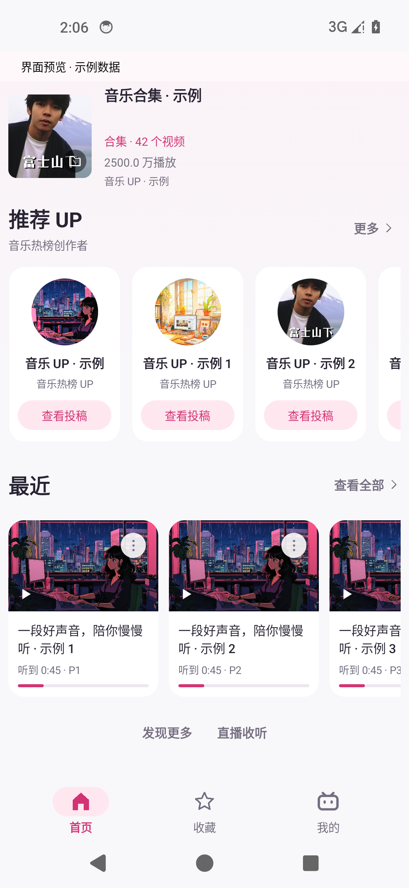</td>
    <td align="center">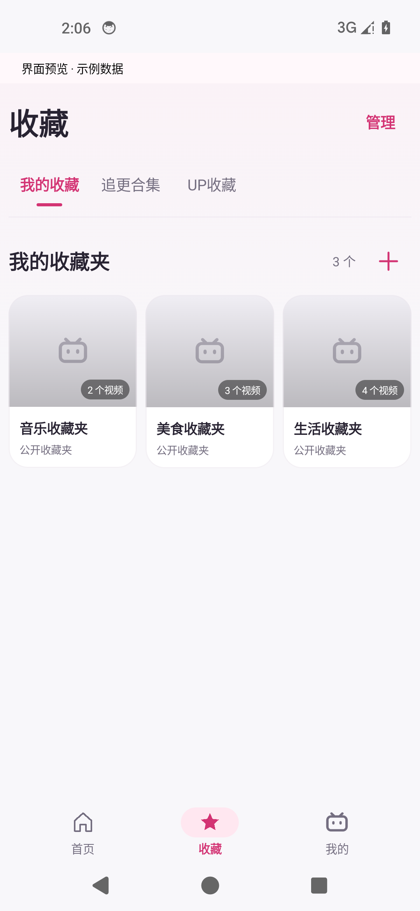</td>
    <td align="center">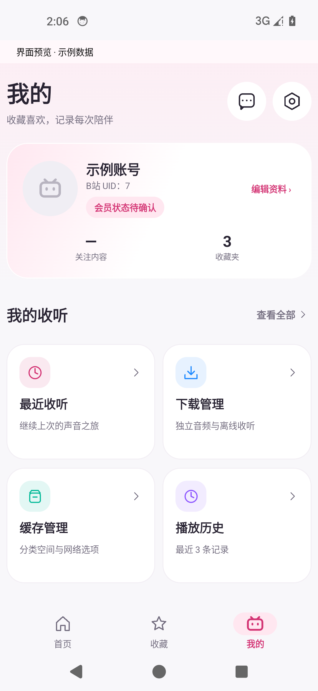</td>
  </tr>
</table>

也有深色模式，点这里看看

  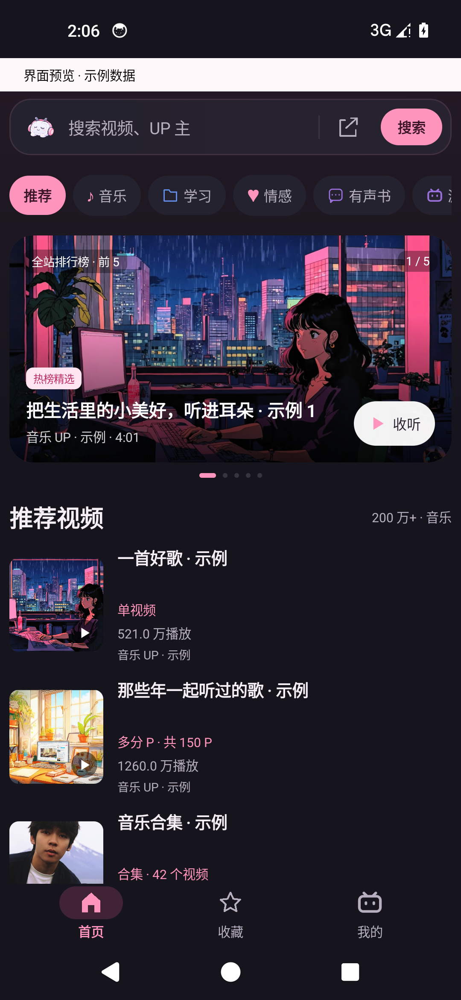
  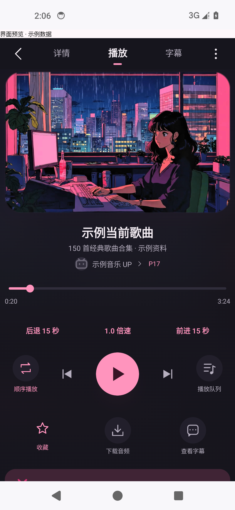
  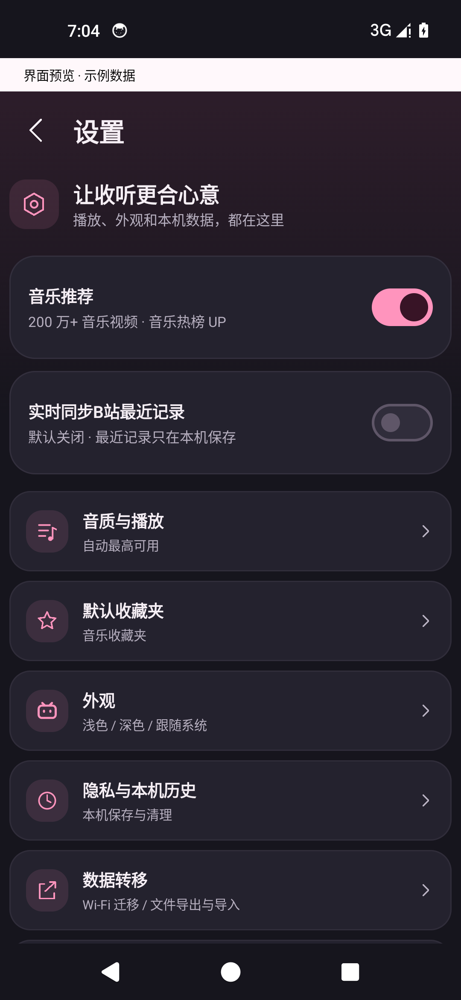

截图来自当前界面的示例数据预览；封面仅作界面展示，示例播放量与账号不是实际平台数据。

## 听起来，有这些方便

### 播放，为收听而做

- **后台与锁屏播放**：切到其他应用、熄屏，继续听；支持系统媒体控制和蓝牙耳机控制。
- **分 P 与合集队列**：看清当前是哪一 P，连续收听长合集；队列支持顺序、随机和单曲循环。
- **倍速与定时**：按自己的节奏听课程、播客，睡前也能设置停止时间。
- **音质与缓存**：自动选择最高可用音质，边播放边缓存；下载和缓存各有管理入口。

### 首页，不只有一张排行榜

- **分类排行榜**：音乐、学习、情感、有声书、游戏、生活，还有直播分类。
- **音乐视频推荐**：默认随机推荐 **200 万播放以上**的音乐视频，不固定只看播放量最高的几个。
- **滑动继续发现**：每批 12 个，向左浏览时继续加载下一批；单视频、多分 P、合集的类型直接标出来。
- **推荐 UP**：音乐热榜创作者也随机展示，找到喜欢的作者，就能进入投稿列表。
- **推荐方向自己选**：关闭设置里的“音乐推荐”，视频和 UP 一起切换到账号首页推荐来源。

### 喜欢的内容，收在一起

- **快速收藏，也能取消**：点一次收藏，再点一次取消；还可以选择其他收藏夹。
- **收藏夹、关注内容、UP 收藏**：常听的内容集中放好，不必每次重新搜索。
- **UP 投稿直接听**：搜索作者、查看投稿，把喜欢的作者加入 UP 收藏，也能把投稿放进队列。
- **最近收听与续听**：本地保存收听记录，方便回到之前的内容和进度。

### 字幕和歌词，跟着声音走

支持视频字幕、滚动字幕和逐行显示，也能调整同步偏移。
音乐内容可以查询歌词候选，选择对应歌曲版本；带逐字时间信息的歌词
可以逐字高亮，普通时间轴则按行同步。

### 桌面上，也能听

播放条、唱片、封面，三种小组件各有自己的样子。
唱片和封面支持 **2×2** 布局，播放条适合横向摆放；不用进入应用，
也能从桌面控制当前收听。

<table>
  <tr>
    <th align="center">唱片 · 2×2</th>
    <th align="center">封面 · 2×2</th>
    <th align="center">播放条</th>
  </tr>
  <tr>
    <td align="center">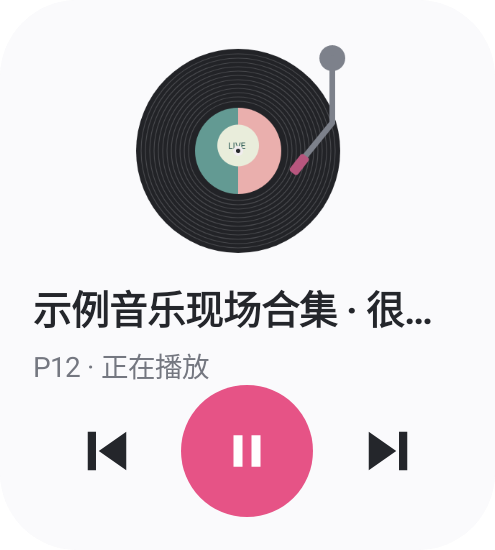</td>
    <td align="center">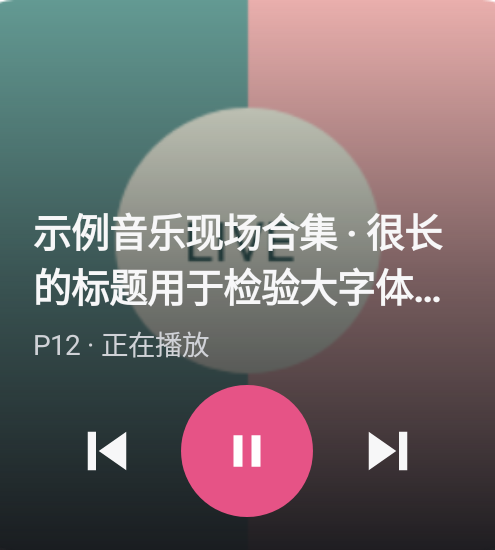</td>
    <td align="center">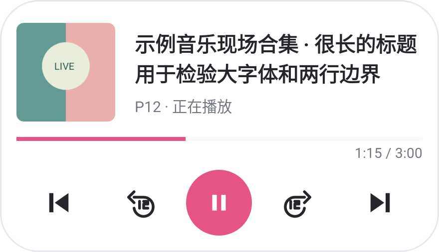</td>
  </tr>
</table>

### 还有这些日常细节

| 内容 | 现在可以做什么 |
| --- | --- |
| 搜索 | 视频、UP 主、搜索联想与热搜 |
| 直播 | 查看直播排行，进入直播间收听 |
| 消息 | 在应用里查看账号私信和通知 |
| 外观 | 浅色、深色、跟随系统 |
| 本地数据 | 收听历史、下载、缓存、数据导出与导入 |
| 换手机 | 局域网数据转移，带走自己的本地数据 |
| 历史同步 | 本地历史正常保存，实时同步 B站最近记录默认关闭，可自行开启 |

看看设置页

  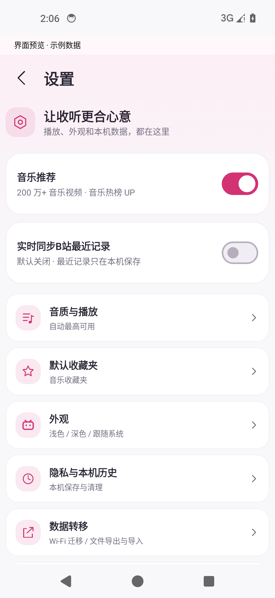
  

## 下载与交流

**Android 8.0 及以上**，当前提供内测安装包：[前往 Releases 下载](https://github.com/JinCrown/bililisten/releases)。

普通用户只需下载 `.apk` 安装包；许可、校验信息与组件源码归档在
[版本材料](docs/public/releases/v0.10.13-beta.1/README.md)，不需要一起下载。

**QQ 交流群：1126192808**。聊使用体验、报 Bug、提好建议，都欢迎。
有问题可以一起找原因，有好的想法也可以一起把软件做得更好。
欢迎提 [Issue](https://github.com/JinCrown/bililisten/issues)、改文档或提交代码，
具体见 [参与说明](CONTRIBUTING.md)。

## 项目说明

金色王冠（Golden Crown）的个人兴趣项目，免费分享，不承诺持续更新。
原创源码允许免费使用、修改和分享，**禁止商用、收费和牟利**。
本项目不是 B站官方客户端，未获官方授权；平台接口与部分功能的可用性可能变化。

[完整许可](LICENSE) · [隐私与本地数据](docs/public/PRIVACY.md) ·
[第三方组件与资源](THIRD_PARTY_NOTICES) · [自己构建](docs/public/BUILDING.md)

感谢每一个使用、反馈和参与的人。
